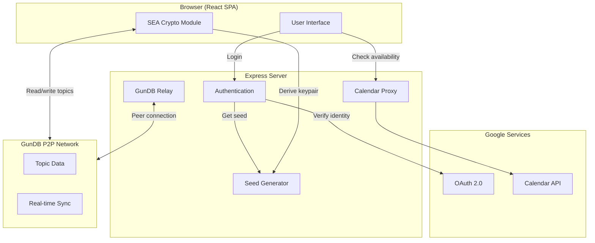
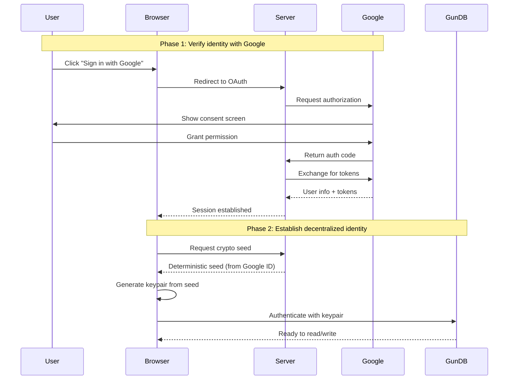

# RallyRound

A decentralized community organizing tool that helps groups coordinate presentations and discussions through a two-stage process: interest gathering and scheduling.

## Overview

RallyRound enables communities to:
- **Stage 1**: Create topics and gather interest from community members
- **Stage 2**: Schedule sessions once interest thresholds are met using Google Calendar integration

Built with a peer-to-peer architecture using GunDB SEA for decentralized data storage and cryptographic authentication, with Google OAuth for identity verification and calendar integration.

## Features

### Two-Stage Process

**Stage One: Gathering Interest**
- Presenters create topics with customizable parameters:
  - Minimum and maximum participant thresholds
  - Session duration
  - One-time or recurring sessions
  - Recurrence patterns (weekly, bi-weekly, monthly)
- Members express interest in topics
- Real-time interest tracking with visual progress indicators
- Automatic transition to Stage 2 when minimum threshold is met

**Stage Two: Scheduling**
- Integration with Google Calendar via OAuth
- Automatic availability checking for all interested participants
- Calendar event creation with all participants
- Support for recurring sessions

### Technical Features

- **Decentralized Architecture**: GunDB for peer-to-peer data synchronization
- **SEA Cryptographic Identity**: GunDB SEA (Security, Encryption, Authorization) for authenticated writes
- **Public-Read, User-Only-Write**: Topics stored in user space, verified automatically by peers
- **Real-time Updates**: Live synchronization of topic changes across all clients
- **Calendar Integration**: Read availability and create events in participants' Google Calendars

## Architecture

RallyRound uses a hybrid architecture that combines traditional web authentication with decentralized data storage:



**How it works:**

1. **Identity**: Users sign in with Google. The server generates a deterministic seed from their Google ID, which the browser uses to derive cryptographic keys. The same user always gets the same keys.

2. **Data Storage**: Topics are stored in GunDB, a decentralized peer-to-peer database. Each user's data is cryptographically signed, so only they can modify it, but anyone can read it.

3. **Scheduling**: Once enough people express interest in a topic, the app checks participants' Google Calendar availability and creates calendar events.

### Key Components

| Component | Technology | Purpose |
|-----------|------------|---------|
| Frontend | React + TypeScript + Vite | Single-page application with real-time updates |
| Backend | Node.js + Express | OAuth handling, seed generation, calendar proxy |
| Database | GunDB with SEA | Decentralized storage with cryptographic authentication |
| Identity | Google OAuth + GunDB SEA | Google verifies who you are; SEA keys let you write data |

### Security Model

- **Google OAuth** verifies user identity
- **Deterministic keys** ensure the same user always gets the same cryptographic identity
- **Client-side key derivation** means private keys never leave your browser
- **Signed writes** let peers verify that data came from its claimed author
- **Public discovery** allows browsing topics while protecting authorship

## Prerequisites

- Node.js (v18 or higher)
- npm
- Google Cloud Project with OAuth 2.0 credentials
- Google Calendar API enabled

## Setup Instructions

### 1. Clone the Repository

```bash
git clone <repository-url>
cd RallyRound
```

### 2. Install Dependencies

```bash
# Install server dependencies
npm install

# Install client dependencies
cd client && npm install && cd ..
```

### 3. Configure Google OAuth

1. Go to [Google Cloud Console](https://console.cloud.google.com/)
2. Create a new project or select an existing one
3. Enable the following APIs:
   - Google+ API (or People API)
   - Google Calendar API
4. Configure OAuth consent screen:
   - Add your email as a test user
   - Add scopes: `userinfo.profile`, `userinfo.email`, `calendar.readonly`, `calendar.events`
5. Create OAuth 2.0 credentials:
   - Application type: Web application
   - Authorized redirect URIs: `http://localhost:8765/auth/google/callback`
6. Copy the Client ID and Client Secret

### 4. Environment Configuration

Create a `.env` file in the root directory:

```bash
cp .env.example .env
```

Edit `.env` and add your credentials:

```env
PORT=8765
NODE_ENV=development

GOOGLE_CLIENT_ID=your_google_client_id_here
GOOGLE_CLIENT_SECRET=your_google_client_secret_here
GOOGLE_REDIRECT_URI=http://localhost:8765/auth/google/callback

SESSION_SECRET=generate_a_random_string_here
SEA_SECRET=generate_another_random_string_here

GUN_PEERS=http://localhost:8765/gun
APP_URL=http://localhost:8765
```

**Important**: `SEA_SECRET` is used to generate deterministic seeds. Keep it secure!

### 5. Start Development Servers

```bash
npm run dev
```

This starts both:
- Backend server on port 8765
- Vite dev server on port 3000 (with proxy to backend)

### 6. Access the Application

Open your browser and navigate to:
```
http://localhost:3000
```

## Authentication Flow

RallyRound bridges Google identity to decentralized storage using a two-phase authentication:



**Why two phases?**

- **Phase 1** proves you are who you say you are (Google's job)
- **Phase 2** gives you a cryptographic identity for the decentralized network

The seed is deterministic: the same Google account always produces the same keypair. This means you can log in from any device and access your data, while your private key never leaves your browser.

## Project Structure

```
RallyRound/
├── server/
│   ├── index.js              # Express server + GunDB relay peer
│   └── routes/
│       └── auth.js           # OAuth, seed generation, calendar API
│
├── client/                   # React SPA (Vite + TypeScript)
│   ├── src/
│   │   ├── components/       # UI: Header, Dashboard, TopicCard, etc.
│   │   ├── hooks/            # useAuth (login state), useTopics (CRUD)
│   │   ├── lib/              # gun.ts (DB client), sea-auth.ts (crypto)
│   │   └── types/            # TypeScript interfaces
│   └── vite.config.ts        # Dev server with API proxy
│
├── .env.example              # Environment template
└── package.json              # Scripts: dev, build, start
```

## API Endpoints

### Authentication

- `GET /auth/google` - Initiate Google OAuth flow
- `GET /auth/google/callback` - OAuth callback handler
- `GET /auth/user` - Get current user info
- `GET /auth/sea-seed` - Get deterministic SEA seed for keypair derivation
- `POST /auth/logout` - Logout current user

### Calendar

- `GET /auth/calendar/availability` - Get user's calendar availability
- `POST /auth/calendar/event` - Create a calendar event

### GunDB

- `/gun` - GunDB peer endpoint (WebSocket)

## Data Model

### Topic (stored in user space: `~pubkey/topics/{id}`)

```typescript
interface Topic {
  id: string;
  title: string;
  description: string;
  presenter: string;
  presenterEmail: string;
  presenterPub: string;        // SEA public key
  minParticipants: number;
  maxParticipants?: number;
  duration: number;
  type: 'one-time' | 'recurring';
  recurrence?: 'weekly' | 'biweekly' | 'monthly';
  stage: 1 | 2 | 3;
  createdAt: number;
  scheduledTime?: number;
}
```

### Public Topic Reference (for discovery: `public-topics/{id}`)

```typescript
interface PublicTopicRef {
  id: string;
  title: string;
  presenter: string;
  presenterPub: string;
  minParticipants: number;
  stage: 1 | 2 | 3;
  interestCount: number;
  createdAt: number;
}
```

## Security Considerations

### Current Implementation

- **SEA Authentication**: GunDB's built-in cryptographic layer
- **Deterministic Keys**: Same user always gets same keypair
- **Server-Mediated Seed**: Server bridges Google identity to SEA identity
- **Automatic Verification**: Peers verify signatures without custom code

### Security Strengths

- All writes cryptographically signed
- Peers automatically reject invalid signatures
- User space protected by default (public-read, user-only-write)
- No custom certificate infrastructure needed

### Known Limitations

- **Server Dependency**: SEA seed generation requires server (for now)
- **SEA_SECRET Compromise**: Would allow impersonation of any user
- **Google Account Compromise**: Leads to GunDB identity compromise

### Production Recommendations

1. **Use HTTPS**: Critical for OAuth and session security
2. **Secure SEA_SECRET**: Store in secure key management (AWS KMS, HashiCorp Vault)
3. **Rate Limiting**: Prevent abuse of seed endpoint
4. **Audit Logging**: Log all seed requests

## Future Decentralization

The server's role is minimal and can be reduced further:

| Current | Future Options |
|---------|----------------|
| Server generates seed from Google ID | Client derives seed from Google ID directly |
| | DID/Verifiable Credentials |
| | Web3 wallet signatures as seed |

The SEA-based topic storage pattern remains unchanged regardless of how the seed is generated.

## Scripts

```bash
# Development (both server and client)
npm run dev

# Server only
npm run dev:server

# Client only
npm run dev:client

# Build client for production
npm run build

# Start production server
npm start
```

## Contributing

Contributions are welcome! Please see [CONTRIBUTING.md](CONTRIBUTING.md) for guidelines.

## License

See LICENSE file for details.
